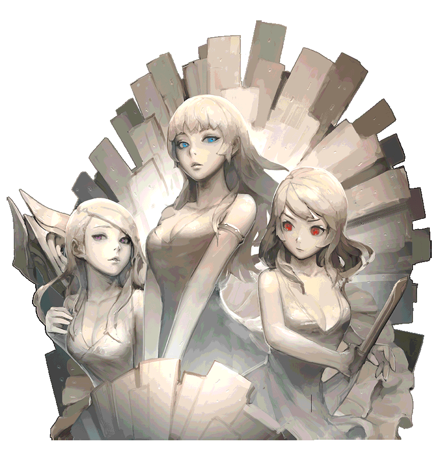

> 玛娜卡尔三姐妹

其实所有的戒指是因为女神库洛诺斯预测到玛娜卡尔将会复活，利用魔铁制成戒指，以此作为夺走使徒玛娜卡尔魔力所消耗的媒介。得知戒指存在意义的阿瑞斯锻炼自己的身心，消减戒指散出的负面气息，完成了只带有强大物理的戒指“阿瑞斯的精淬“。

> 图书馆管理员潘多拉

考上罗曼共和国士官学校战斗班就可以得到粗糙戒指。用途不明确，就连学生也不知道为什么教授们要给这个戒指。红色石头上微微散发着魔力。

士官学校战斗班的优等生可以获得镶有红宝石的戒指。发出红光的红宝石上散发出的魔力比起红戒指还要强。能让战斗力与勇气变得更强大。

成为罗曼共和国大会议“奥林巴斯”的议员，继承“阿瑞斯”之名与“战场之黄金盔甲团”的话，除了阿瑞斯本身外，队员也会受到全胜的神秘戒指“阿瑞斯的愤怒”影响，战斗力大大提升，但是拥有者也会变得异常好斗。

透出美丽光彩的红宝石散发着魔力，阿瑞斯在战斗中获得胜利或立下大功时，会赐给“黄金盔甲团”宝石周围用华丽的黄金点缀的戒指作为礼物。因为带上这个截止后战斗力会大幅度提升并且内心会变的残酷，所以将此戒指称作“阿瑞斯的震怒”。

因为使用“阿瑞斯的震怒”，自己跟队员们全部变得残忍，使阿瑞斯陷入了悲痛之中。阿瑞斯向哈迪斯请求，通过他的祝福让戒指对人性的影响降至最低，最新做成的戒指取名为“阿瑞斯的觉悟”，并对雅典娜隐藏了关于戒指的真相。

其实所有的戒指是因为女神库洛诺斯预测到玛娜卡尔将会复活，利用魔铁制成戒指，以此作为夺走使徒玛娜卡尔魔力所消耗的媒介。得知戒指存在意义的阿瑞斯锻炼自己的身心，消减戒指散出的负面气息，完成了只带有强大物理的戒指“阿瑞斯的精淬“。

乘着闪电力量出生的宙斯从小就很有名。虽然父母希望自己能去士官学校，但是崇尚自由的宙斯放弃上学，而是选择聚集自己的追求者，创立了“雷声的崇拜者”，并以带有闪电的高贵戒指做为象征发放给队员们。

“雷声的崇拜者”是由一群向往宙斯力量的人聚集在一起的团体，所以大家基本上都会一点武功。宙斯从中挑选可以信任且武力高强的人，任命为自己的护卫队，并给镶蓝宝石的“高尚的蓝色戒指”。

带领雷声的崇拜者，从未战败的宙斯因而名声远播，正好当选了奥利巴斯的议员。他将雷声的崇拜者编入“霹雳闪电军团”，并赠予了议员宙斯部队带来的蓝戒指。"宙斯的闪电"戒指深受团员们的喜爱。

除了与议员宙斯一起的战斗之外，就连狩猎也是大获全胜，人气上涨的霹雳闪电军团受到罗曼共和国的居民们喜爱，除了人气投票第1名之外，还可以得到使用更大更闪的蓝宝石做的戒指“宙斯的雷鸣”。宙斯将戒指平均分配给霹雳闪电军团的精锐士兵们。

“宙斯的闪电”与“雷鸣”可以帮助戴上的人从强大魔力中获得相当的斗志而成为勇士，但同时也会将戴上的人个性变为过度自由奔放，渐渐出现了不服从命令或逃离等现象。宙斯将自己的闪电力量放入宝石中，制作出减少异常现象发生的“宙斯的爆发”。

虽然重新发放了戒指”宙斯的爆发“，但是逃离的士兵只增不减。宙斯因为戒指的事情苦恼不已，就在查看议会的机密文档时，得知戒指是为了压制使徒玛娜卡尔，利用魔铁所制成的事实。宙斯认为不能输给区区一个使徒，将自己所有的闪电释出，完成了完美无缺的戒指”宙斯的闪光“。

罗曼共和国士官学校的特殊训练班的学员们才能达到戒指。就如其名，得到戒指后会发生意外或者出现梦游症等事情。学员们当做是一种宣告仪式，并也听说了这些事情与玛娜卡尔之塔有关的消息。

发放给经历过残酷的训练后成为特殊训练班，进而知道特殊部队“斯提斯”存在的优生们。戒指中间镶上的紫色宝石所凝聚的不详魔力提高了学员们的战斗力，同事也折磨着他们。

“不详的紫色戒指”所指派的考验其实是特殊部队如对资格的测验。通过考验他们从士官学校毕业后，被任命为罗曼共和国大议会“奥林巴斯”议员阿瑞斯所带领的特殊部队“斯提斯”的队员，信物是阿瑞斯亲自制作，将不详的气息出去的祝福戒指“哈迪斯的祈福”。

送给与议员阿瑞斯一起完成无数暗中刺伤与困难任务的特殊部队“斯提斯”老手们的戒指。在那更大更闪的紫色宝石上，里面的魔力更加厉害。这个戒指包含了阿瑞斯的恩宠，包邮老手们不会出意外，可造成更搭的勇气与强大的力量。

当珀耳塞福涅完全堕落时，阿瑞斯与特殊部队紧急前往帮忙，但所有人已被邪恶气息感染陷入堕落之中。因为无法守护自己的队员而感到绝望的阿瑞斯，常常爬上光荣之山脉，真诚的向祖先祈祷，这时出现了灵魂之光将邪恶气息击退，并做出了“哈迪斯的支持”戒指。

制作“哈迪斯的支持”时帮助过阿瑞斯的祖先们出现在阿瑞斯的梦中，托付阿瑞斯去审判珀耳塞福涅。为了报答祖先们的恩惠，阿瑞斯将带有更强魔力的紫色戒指仔细加工之后做出“哈迪斯的审判”，并与提斯提的队员一起下审判的誓言，大家一起戴上戒指后，便前往攻击隐居者的女王。

考上士官学校中竞争率最高的防护对策班就可以获得的戒指。虽然是金色的，但因为是镀金的关系，所以非常坚固。防护对策班之所以竞争率很高的理由是可以以优先顺位加入议员雅典娜“太阳的守护者”的缘故。

成为士官学校防护对策班的优生就可以获得“坚硬的黑色戒指”。镶在戒指中间的黑色宝石带有的魔力可以让学徒们替自己感到荣耀与自豪，使他们可以更专注在防护对策班。

传承至议员雅典娜与“太阳的守护者”的戒指。被称为“雅典娜的防护”，带有魔力的黑钻石闪闪发亮。但为了不在使用盾牌时造成障碍，所以宝石不会凸出来，算是小巧精致的戒指。黑色魔力让持有者的内心变得坚定，让自己成为防卫队的盾牌之一。

雅典娜戴上“雅典娜的防护”时，发现忘记所有东西的自己，并开始好奇戒指的来源。经过一番调查之后，她发现了首代雅典娜留下的记录，得知姐只是为了抵抗玛娜卡尔利用魔铁所制成的。并传承给奥林巴斯的议员们。雅典娜为了遵照祖先们的理念，以守护之光环绕戒指。

虽然戒指“雅典娜的守护”受到雅典娜的保护网包围，但是光线却不能永久持续。雅典娜重新翻找了记录，后来在陈旧的资料中发现了守护的意志可以装在神圣的月桂石上面。她将聚集守护者的意志与光线的月桂石加在戒指上，重新加工之后，就可以抵抗幻觉的气息。

雅典娜不满意“雅典娜的护法戒指”。结束不停提醒自己拥有钢铁般的意志与坚定的自负心的残酷训练之后，将她的意志加在月桂石身上，完全封印了玛娜卡尔的邪念。雅典娜将完成的戒指取名为“雅典娜的光荣”，戒指随时为雅典娜带来极为骄傲的胜利。

留下“赫拉”这名字的首代议员是当时罗曼的王女代替逃亡的望，与侍女们一起留在战场支援救护物资和看护患者，付出真心帮助了战争。虽然她总是穿着朴素的衣服，但手上总是戴着华丽的戒指。

华丽的戒指是赫拉的母亲留下的遗物，得知这件事的人民为了赫拉，收集了许多银块，让华丽的戒指变得更加优雅，闪亮。戴上华丽银戒指的赫拉十分微风地穿梭战场之中，还在部分贵族中掀起风潮。

使徒战争结束后，受到人民推举加入奥林巴斯的赫拉从女神库洛诺斯听到关于玛娜卡尔与魔铁的事情，会议结束后，为了阻止玛娜卡尔，欣然收下吸收魔力的魔铁。所以最开始制成的魔铁戒指就是“赫拉的气息”。

知道戒指“赫拉的气息”偶尔会透出玛娜卡尔怒气的首代赫拉向女神库洛诺斯请求协助，库洛诺斯利用赫拉温柔且慈祥的手将可拉的气息加入戒指，将戒指可以阻挡怒气，并命名为“”

装在戒指“赫拉的抚摸”的可拉气息经过时间的流逝变得微弱，知道戒指秘密的现代赫拉认为需要更大的意志与光，与很久前就侍奉议员赫拉的“慈爱的彩虹”团员们一起，将慈悲与爱的力量聚集在戒指之中，做出了隐隐散发光彩的“赫拉的慈爱”。

就连戒指“赫拉的慈爱”也会发出愤怒的气息，几经苦恼之后，赫拉决定独自前往奥林巴斯的神殿。神奇的是野兽们看到充满慈爱之光的她会自动躲开，在祈祷了好长一段时间过后，从以前到现在所有赫拉们追求和平的心愿化作一道璀璨的蓝光，承载蓝光的“赫拉的心愿”就此诞生。

各种信息不详的生锈戒指，在玛娜卡尔之塔附近发现。现在被罗曼共和国大议会奥林巴斯议员哈迪斯的特殊部队提斯提研究中。可以感觉到戒指中间圆圆的黑色石头透出微弱的魔力。

研究着生锈戒指的斯提斯队员们意外被割到手指，血流下来的时候居然被戒指吸收，且石头开始像宝石一样发出微微的亮光。收到报告的议会下达封口令，开始寻找戒指的主人。

某天，虽然是奥林巴斯的议员，但隐藏身份的“隐居者的女王”珀耳塞福涅醒来了。她拥有强大魔力，受到女神库洛诺斯的托付，长久以来戴着魔铁制成的“珀耳塞福涅的饥渴”昏睡着，因为这样受到不详气息吞噬，变得渴望血液与魔力，从梦中苏醒过来。

珀耳塞福涅被锁在血迹之中，为了生存消耗魔力，再用戒指恢复。但是玛娜卡尔的亡灵已经吞噬她很久一段时间，并在她耳边说要给她更强大的力量。珀耳塞福涅屈服于欲望之下，亡灵用其他戒指与血作为媒介，告诉她可以在戒指上装更多强大魔力的方法。

堕落的珀耳塞福涅照着亡灵的指示攻击议会，贪图新鲜的血并偷走戒指后逃向了玛娜卡尔之塔。珀耳塞福涅想玛娜卡尔的亡灵献上戒指，并吸收作为奖励的戒指强大魔力。因此形状更为扭曲的“珀耳塞福涅的贪食”就此出现。

因为珀耳塞福涅的缘故，玛娜卡尔之塔慢慢找回力量且蠢蠢欲动。在塔的变形上，珀耳塞福涅只有碰到魔力的扩大范围就可再次进化戒指，但是新戒指“珀耳塞福涅的狂气“再也无法满足她。她为了拥有更强大的戒指，去寻找更厉害更美丽的魔力，然后她突然消失了。

古代，在孕育神圣之火并有战争发生的东部上流传一个传说。据说一到晚上，有个戴着比夜还有黑的妖怪面具的武士，挥刀屠戮眼前所看的一切。人们为了防止妖怪，一直都戴着装饰着武士面具的戒指。

埋葬在古老的火山中柳国初代神女的遗物，虽然经过漫长的时间变得陈旧了，但散发着如摇曳的火光搬的神秘气息。内侧还刻有文字"请给个寻找隐藏的真相的机会。"。

戒指逐渐象征着一个可以除了防止妖怪武士，还能防止所有厄运的符咒。接着制作了神圣之音。不知是否因为戒指，从何时开始妖怪武士没有再次出现过了，传说也在人们的记忆中淡去。但是妖怪武士确实是存在的。

戴着黑妖面具的武士只要一睁眼就要与能将自身淹没的鬼哭声战斗。武士为了不乱挥刀，做了各种努力与尝试，都以失败告终。闻着血腥味，武士绝望了。直到某日遇见整洁的穿着雪白色上衣与红色裙子的女子。

女子没有告诉她自己是谁，但没有任何言语握紧双手进行了祈祷。武士第一次停止了挥刀，并颤抖着双手注视着改女子。女子制作了一个装着自己血液并缠着红白双线的符咒交个了武士，并让其前往古老的火山。

戴着丑陋面具的武士并不知道古老的火山的所在地。女子短暂思考后将手指向了虚空。然后伴随着天空破碎的声音飞来一只鸟，并做了一个跟随鸟的手势。短暂犹豫后，背离女子跟着鸟离开了。

走向古老的火山的路是漫长又惊现。与女子越来越远，鸟也逐渐看起来与天空的颜色一样。过了很长时间，为了跟上只能看见模糊轮廓的鸟，武士只能看着天空前进。但在某一瞬间，天空上看不到鸟的身影，没有前进方向的武士只能停在原地。

普格斯为了感谢勇士团长们帮助测试树精机器人，赠送了1个名为'普格斯大成功戒指'。不是说佩戴了'普格斯大成功戒指'，大成功的概率就会有所提高哦。

每天通过制作并出售首饰维持生计的少年，在某一天做了一个梦。梦见一个伴随雷声破碎虚空飞来的鸟变成一个巨大的火龙，并请求少年到古老的火山帮助一个徘徊的人。少年只是认为是一个比较荒唐的梦，但重复多次后无法否定了。

少年又重新做了梦,龙的眼睛散发着红光，说出就是现在的瞬间，少年醒了。世界一片寂静，少年不顾黑暗的夜晚跑了起来。洁白的衣服被冰冷的月光所破碎。最终少年见到了传说中带着妖怪面具的武士,但一点也可怕。

武士记起了自己是谁，是在东部战争中刽子手。虽然已死亡，但一直没有放下刀。是一个比妖怪还要可怕的冤魂。在红光下武士很羞愧又痛心。最后被红光净化后彻底的消失了。少年在不知不觉中留下了眼泪，同时也知道了自己应该需要做的事情。

少年愿武士的灵魂可以安息,也愿倒在与武士统一战争中所有灵魂可以安息，精心制作了戒指。蕴含着迫切愿望的戒指成为了包含指引红光的符咒。虽然微弱，但也将净化的气息扩散了。即使如此,冤魂依然留在东边最高的地方…

少年在月光的照射下看到了武士走过的路。虽然是第一次走的路,但是脚步却很轻盈,没有丝毫的犹豫。来到古老的火山一半的时候，少年闻到了浓烈的血腥味。回头一看,每个武士的足迹都显现出了血迹。少年大吃一惊,但武士摇着头并指向前方。

少年强忍着眼泪走向古老火山的最高处。随着前进血腥味越来越浓，武士的身体越来越模糊。不知重复了几次太阳落山与月亮倾斜，少年抵达了火山之巅。在晃动的红光下回头看向武士。看着武士一直戴着的面具逐渐融化消失掉。

普格斯为了感谢勇士团长们帮助测试树精机器人，赠送了1个名为'普格斯大成功戒指'。不是说佩戴了'普格斯大成功戒指'，大成功的概率就会有所提高哦。