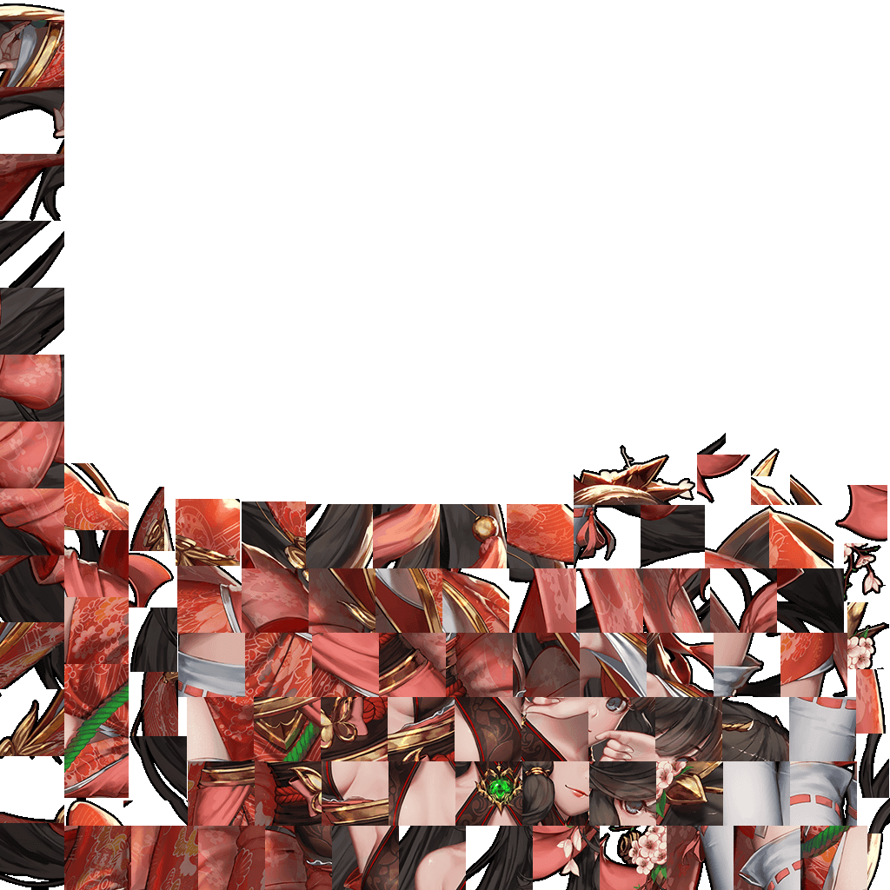
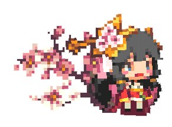

<link rel="stylesheet" type="text/css" media="screen" href="/styles/bubble.css" />

> [下载psd原画](./atlas0-073690.psd)

柳国乡镇地主的女儿。地主曾是继承王位的王族，不过非常不喜欢这种政治斗争，所以来到了乡镇生活。跟随父亲来到乡镇的辉夜姬对于这种平淡和平的日子感到非常满足，过着幸福的日子。
<blockquote>辉夜姬</blockquote>

从小起辉夜姬就非常消瘦，并且喜欢在田野里用弓箭狩猎。虽然偶尔会闯出大祸，不过因为她的好脾气和活泼的性格与人们走的非常近，大部分人往往都会原谅她。

<blockquote>公主 辉夜姬</blockquote>

唯独樱花盛开的某天夜晚，妖怪出现在乡镇里，并攻击了居民，使大家非常恐慌。这时候，辉夜姬持着弓箭出现在现场，并一箭射中怪物。这样的场面一直留在大家的记忆里。

<blockquote>月姬 辉夜姬</blockquote>

##### 时装

> 宇宙探索者 辉夜姬

> 樱花温泉 辉夜姬

<audio hidden autoplay loop>
  <source src="/audio/BGM_HERO_HOUSE_LOOP.wav" type="audio/wav">  
</audio>

