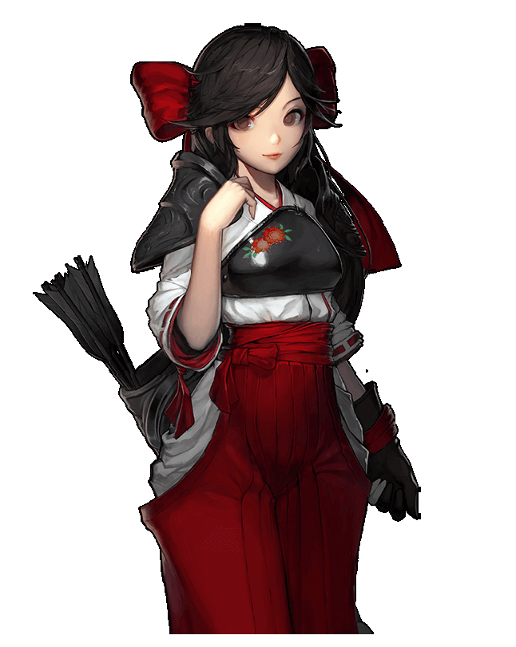
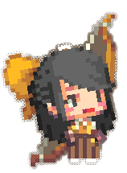

<link rel="stylesheet" type="text/css" media="screen" href="/styles/bubble.css" />

> [下载psd原画](./atlas0-172650.psd)

来自东方王国的留学生，有个姐姐名叫香织。她还没适应留学生活，但姐姐与她不同，可以独自克服困境，因此小光很崇拜其姐姐。
<blockquote>小光</blockquote>

小光从小一直看着坚强而又能干的姐姐长大，于是总拿她跟自己做比较。因此虽然小光箭术过人，却因自卑感而一直没有发现自己真正的实力。

<blockquote>一箭双雕小光</blockquote>

某天小光收到一封姐姐写的信，信里写着“走自己的路吧”，从那之后小光终于从姐姐的阴影中走了出来。每当遇到困难时，她对自己总是坚信不疑，而这时射出的每支箭都会百发百中。

<blockquote>百发百中小光</blockquote>

##### 时装

> 泰迪熊 小光

> 私立弓道学园小光

<audio hidden autoplay loop>
  <source src="/audio/BGM_HERO_HOUSE_LOOP.wav" type="audio/wav">  
</audio>

