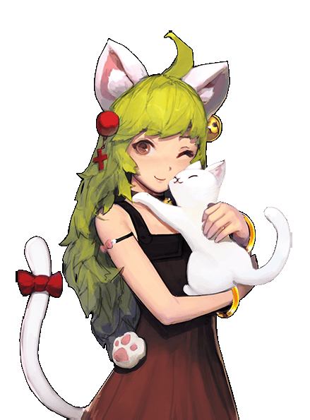
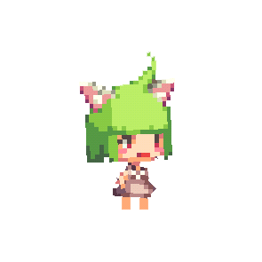
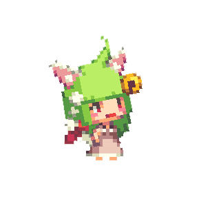
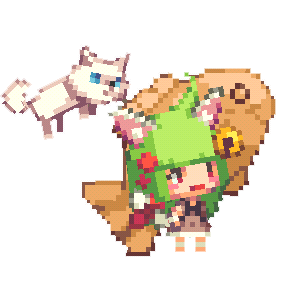
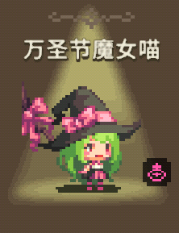
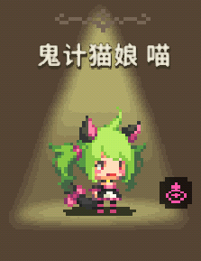

<link rel="stylesheet" type="text/css" media="screen" href="/styles/bubble.css" />

> [下载psd原画](./atlas0-039450.psd)

因为喜欢猫咪，身上总是戴着猫耳饰品的爱猫人士，认为只要当上兽医就能尽情抚摸猫咪，所以选择了学医。
<blockquote>喵</blockquote>

某天醒来后，喵发觉她变成了猫女。换作是普通人的话一定会大吃一惊，但喵反而感到很高兴。
<blockquote>猫女喵</blockquote>

喵成为猫女后开始更加了解猫咪，而且为了与猫咪们进行更多地交流，她做了个超大的鲷鱼烧来诱惑猫咪们。
<blockquote>猫咪大师喵</blockquote>

##### 时装

+  
+  
+  